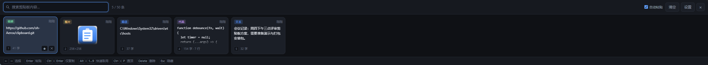
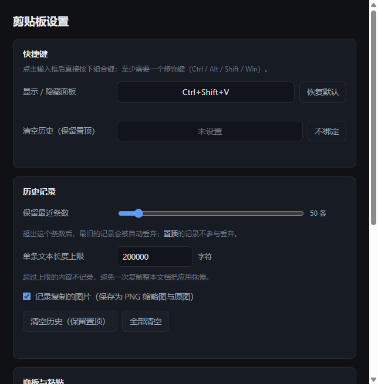

# 剪贴板（Clipboard Panel）

Windows 上的剪贴板历史工具：复制过的内容以**方块形式平铺在屏幕底部**，一个快捷键唤出，选中即回填剪贴板并自动粘贴到当前窗口。



## 功能

| 需求 | 实现 |
| --- | --- |
| 支持 Win10 及以上系统 | 基于 Electron 44（Chromium 152），支持 Windows 10 / 11 64 位 |
| 方块形式，平铺屏幕底部 | 无边框窗口贴在光标所在显示器的工作区底部，方块横向平铺、可滚动 |
| 支持搜索剪贴板内容 | 面板左上角实时搜索，**全文匹配**（不止预览部分）、忽略大小写、命中处高亮 |
| 支持配置丢弃的长度 | 设置里指定保留条数（默认 50，可 5–1000），超出自动丢弃最旧的；**置顶的条目不参与丢弃** |
| 支持设置快捷键 | 设置里直接按下组合键即可录制，注册前先校验是否被别的程序占用 |

顺带做了的：

- **文本与图片**都会记录。图片存为 PNG，方块里显示缩略图。
- 自动识别内容类型（链接 / 邮箱 / 路径 / 代码 / 文本 / 图片）并打标签。
- 选中后自动向前台窗口发送 `Ctrl+V`，可关闭。
- 置顶常用内容，不会被条数上限挤掉。
- 常驻托盘；重复内容不会产生第二个方块，只会提到最前面。

## 安装与运行

需要 Node.js 18+。

```bash
npm install
npm start
```

> 国内网络下载 Electron 二进制可能很慢或失败，可以先设置镜像再安装：
>
> ```bash
> set ELECTRON_MIRROR=https://npmmirror.com/mirrors/electron/
> npm install
> ```

启动后应用只驻留在托盘，按 `Ctrl+Shift+V` 唤出底部面板。

## 打包成安装包

```bash
npm run dist    # 生成 dist\ClipboardPanel Setup 1.0.0.exe（NSIS，约 106 MB）
npm run pack    # 只生成 dist\win-unpacked\，双击 ClipboardPanel.exe 即可免安装运行
```

安装包是可选安装目录的向导式安装（非一键静默），会创建桌面快捷方式。首次构建时
electron-builder 需要下载 NSIS 工具链，国内网络建议先设镜像：

```bash
set ELECTRON_BUILDER_BINARIES_MIRROR=https://npmmirror.com/mirrors/electron-builder-binaries/
npm run dist
```

> 安装包**没有代码签名**（没有配置证书），Windows SmartScreen 首次运行会提示
> “未知发布者”，需要点“更多信息 → 仍要运行”。要消掉这个提示得配置代码签名证书，
> 在 `package.json` 的 `build.win` 里加 `certificateFile` / `certificatePassword`。

## 操作

| 按键 | 作用 |
| --- | --- |
| `Ctrl+Shift+V` | 显示 / 隐藏面板（可改） |
| 直接输入 | 搜索剪贴板内容 |
| `←` `→` / `Home` `End` | 选择方块 |
| `Enter` | 取用并粘贴到前台窗口 |
| `Ctrl+Enter` | 只回填剪贴板，不粘贴 |
| `Alt+1…9` | 快速取用第 1–9 个方块 |
| `Ctrl+P` | 置顶 / 取消置顶 |
| `Delete` | 删除当前方块 |
| `Ctrl+,` | 打开设置 |
| `Esc` | 隐藏面板 |

鼠标：单击方块取用，`Ctrl` + 单击只复制不粘贴；方块右下角有置顶与删除按钮；滚轮横向滚动。

## 设置



设置改动即时生效并写盘，无需保存。数据都放在 `%APPDATA%\clipboard-panel\`：

| 文件 | 内容 |
| --- | --- |
| `config.json` | 配置项 |
| `history.json` | 历史记录（文本正文直接存在这里） |
| `images\*.png` | 图片记录的原图 |

配置项：

| 键 | 默认值 | 说明 |
| --- | --- | --- |
| `maxItems` | `50` | 保留条数上限（5–1000），置顶项不计入 |
| `hotkeys.toggle` | `Ctrl+Shift+V` | 显示 / 隐藏面板 |
| `hotkeys.clear` | `""` | 清空历史（保留置顶），空表示不绑定 |
| `autoPaste` | `true` | 取用后自动发送 `Ctrl+V` |
| `hideOnBlur` | `true` | 面板失焦自动隐藏 |
| `panelHeight` | `240` | 面板高度（160–600） |
| `pollInterval` | `600` | 剪贴板检测间隔毫秒（200–5000） |
| `captureImages` | `true` | 是否记录图片 |
| `maxTextLength` | `200000` | 超过该长度的文本不记录 |
| `launchAtLogin` | `false` | 开机自启 |

配置文件损坏或字段非法时会回落到默认值，不会导致应用起不来。

## 开发

```bash
npm run dev       # 带 --dev 启动，托盘菜单里多一个开发者工具入口
npm start -- --show   # 启动即展开面板，省得按快捷键
npm test          # 核心逻辑冒烟测试（53 项）
npm run preview   # 渲染真实界面并截图到 tests/screenshots/
```

`npm test` 里有一段会**短暂占用系统剪贴板**（写入再读回，用于验证抓取链路），跑完会把原来的文本写回去。

`npm run preview` 用固定假数据把真实的 `panel.html` / `settings.html` 渲染出来，驱动搜索、无结果、空历史等状态并各截一张图，改完界面可以直接跑来看效果，不需要手工操作。

图标是脚本生成的，改配色后重新跑：

```bash
python tools/make_icons.py
```

## 代码结构

```
src/main/          主进程
  main.js            窗口、托盘、IPC 编排
  store.js           配置与历史的持久化、条数上限与置顶规则
  watcher.js         轮询系统剪贴板、内容去重、类型识别
  query.js           历史搜索、排序与投影给渲染进程的字段
  hotkeys.js         全局快捷键注册与可用性校验
  paste.js           常驻 PowerShell 进程，用于发送 Ctrl+V
src/preload/       contextBridge 通道（渲染进程拿不到 Node）
src/renderer/      面板与设置界面
tools/             图标生成脚本
tests/             冒烟测试与界面预览工具
```

几个值得说明的取舍：

- **搜索在主进程做。** 渲染进程手上只有每条 400 字的预览，正文全文只存在主进程；放在渲染进程过滤会漏掉长文本靠后的内容。
- **轮询而不是监听。** Windows 不向 Electron 透出剪贴板变更事件，只能定时轮询 + 内容哈希去重。
- **图片按字节数短路。** 剪贴板上放着一张大图时，字节数没变就不重新取数据和哈希，把每轮开销降到零；代价是紧接着换成一张字节数完全相同的图会漏记。
- **粘贴用常驻 PowerShell。** 每次粘贴都新起 `powershell.exe` 要 300ms 以上，常驻后单次粘贴只是往 stdin 写一行。
- **Electron 44 的剪贴板 API 是异步的**（`readText()` 返回 Promise，图片走 `read()` + `ClipboardItem.getType('image/png')`），旧版的 `readImage()` / `availableFormats()` 已被移除。测试里专门有一段打真实 API，就是为了拦住这类上游变更。

## 已知限制

- 只做了 Windows。自动粘贴依赖 `SendKeys`，`paste.js` 在非 Windows 上直接空转。
- 自动粘贴向“当前前台窗口”发键。以管理员权限运行的窗口不接受普通权限进程发来的按键，这种情况下请用 `Ctrl+Enter` 只复制，再手动粘贴。
- 历史以明文 JSON 存放，复制过的密码等敏感内容同样会落盘；介意的话把保留条数调小，或用托盘菜单随手清空。

## License

MIT
